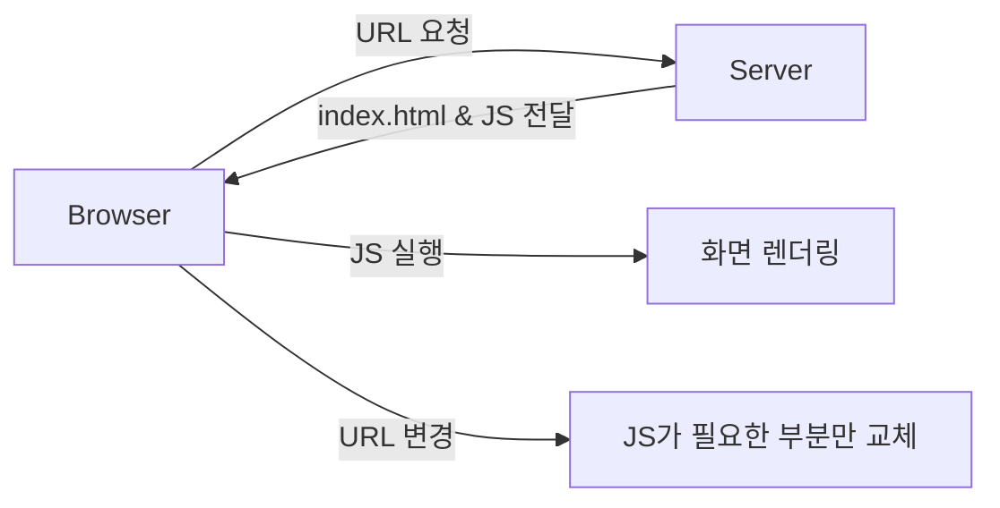

- 한 입 크기로 잘라먹는 리액트의 최종장
  - 프로젝트 3 
    - 감정 일기장
    
    <br>
    
---
<br>    


css에 변화를 주어 일기장 같은 디자인으로 바꾸었음


- 배경: 크림색
- 일기: 회색과 실선으로 일기장 느낌
- 폰트 변경: 나눔 펜 스크립트를 일기 내용에만 해당함

*기능 변경은 없음!*

---

# 페이지 라우팅 (Routing)
- 사용자가 요청한 URL에 따라 알맞은 페이지를 보여주는 기술
- 웹 애플리케이션의 사용자 경험(UX)을 결정짓는 핵심 아키텍처

## MPA vs SPA

| 구분 | MPA (Multi Page Application) | SPA (Single Page Application) |
|---|---|---|
| 방식 | 페이지 이동 시마다 새로운 HTML을 서버에서 수신 | 단일 HTML을 로드한 뒤 자바스크립트로 부분 업데이트 |
| 특징 | 전통적인 방식, 페이지 이동 시 '깜빡임' 발생 | 모던 웹 방식, 앱처럼 부드러운 전환 |
| 렌더링 | **SSR** (Server Side Rendering) | **CSR** (Client Side Rendering) |

<br>

### SPA의 동작 흐름 (CSR)


---

# Router 설정
프론트엔드에서 라우팅을 관리하기 위해 보통 라이브러리(예: `react-router-dom`)를 사용한다.

## 주요 컴포넌트

| 요소 | 설명 |
|---|---|
| BrowserRouter | 브라우저 주소창과 앱을 연결 (최상위) |
| Routes | 요청된 URL과 일치하는 Route를 탐색 |
| Route | 경로(path)와 컴포넌트(element)를 매핑 |

<br>

## 프로젝트 적용 예시 (`App.jsx`)

```jsx
<Routes>
  <Route path='/' element={<Home />} />
  <Route path='/new' element={<New />} />
  <Route path='/diary/:id' element={<Diary />} />
  <Route path='/edit/:id' element={<Edit />} />
  <Route path='*' element={<Notfound />} />
</Routes>
```

- `path='*'` : 정의되지 않은 모든 경로는 'Notfound' 페이지로 유도

---

# 동적 경로 (Dynamic Path)
- URL의 일부분을 변수처럼 사용하여 데이터를 식별하는 방식
- 상세 페이지나 수정 페이지에서 특정 아이템을 구분할 때 사용

## 파라미터 (Parameters) 활용

```jsx
// 경로 설정 예시
<Route path='/diary/:id' element={<Diary />} />
```

<br>

### useParams로 데이터 식별 (`Diary.jsx`)

```javascript
import { useParams } from "react-router-dom";

const params = useParams();
// 만약 URL이 /diary/10 이라면 params.id는 "10"이 됨
```

&rarr; 하나의 컴포넌트(`Diary`)를 재사용하여 수많은 일기 데이터를 보여줄 수 있음

---

# 웹 스토리지 (Web Storage)
- 브라우저 내부에 데이터를 저장하는 저장소
- 서버 통신 없이도 사용자 데이터를 로컬에 보관 가능

## 스토리지 종류 비교

| 구분 | localStorage | sessionStorage |
|---|---|---|
| 유효 기간 | 직접 삭제 전까지 **영구 보관** | 탭이나 창을 닫으면 **삭제** |
| 용도 | 자동 로그인, 작성 중인 글 저장 | 일회성 보안 인증 정보 |

<br>

## 데이터 영속성 관리 (`App.jsx`)

```javascript
// 1. 데이터 저장: 객체나 배열은 반드시 JSON 문자열로 변환
localStorage.setItem("diary", JSON.stringify(nextState));

// 2. 데이터 복구: JSON 문자열을 다시 객체로 변환
const storedData = localStorage.getItem("diary");
const parsedData = JSON.parse(storedData);
```

---

# 오픈 그래프 (Open Graph)
- 소셜 미디어(카톡, 페이스북 등)에서 링크를 공유했을 때 미리보기를 설정하는 프로토콜
- 서비스의 첫인상을 결정하며 클릭률에 직접적인 영향을 미침

## 메타 태그 설정 (`index.html`)

```html
<head>
  <meta property="og:title" content="감정 일기장" />
  <meta property="og:description" content="나만의 작은 감정 일기장" />
  <meta property="og:image" content="/thumbnail.png" />
</head>
```

<br>
	

---

# 요약

- **SPA**는 필요한 부분만 업데이트하여 성능과 UX를 모두 잡는 방식
- **Router**를 통해 복잡한 페이지 이동과 데이터를 효율적으로 연결
- **Web Storage**를 적절히 활용하면 서버 없이도 데이터를 안전하게 유지
- **Open Graph**는 서비스의 외부 노출 품질을 결정하는 프론트엔드의 필수 체크리스트
